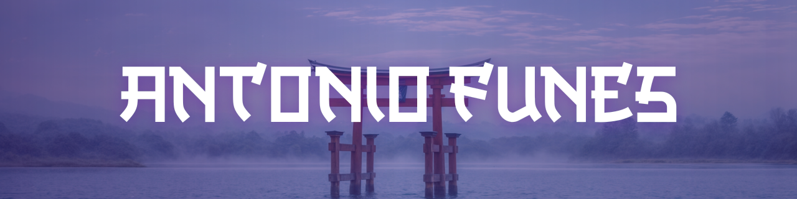

  

Software Developer | Systems Engineering Student

La Pampa, Argentina

<!-- Enlaces de Contacto y Portfolio -->

 

### ⛩️ Sobre Mí (About Me)
Soy estudiante de la carrera de **Ingeniería en Sistemas / Analista Programador** en la [Facultad de Ingeniería de la Universidad Nacional de La Pampa (UNLPam)](https://www.ing.unlpam.edu.ar/). Toda mi adolescencia me gustó aprender cosas nuevas y darle solución a problemas de distintas magnitudes. Desde chico me gusta mucho la tecnología.

Soy de Parera, La Pampa, y actualmente estoy viviendo en General Pico, La Pampa. Busco siempre un equilibrio entre el desarrollo profesional, apuntando a oportunidades de trabajo remoto, y la colaboración activa con la comunidad tecnológica.

### 🎯 Enfoque Actual (Current Focus)
- **Arquitectura y Comunidad:** Perfeccionando mis habilidades en el stack de desarrollo web y participando en la organización de entornos de estudio colaborativos.

### 🚀 Proyectos Destacados (Featured Projects)
- **Sistema de Gestión de Negocios:** Aplicación web escalable diseñada para digitalizar y optimizar la administración comercial de tiendas. Permite a los dueños controlar el stock y precio de los productos en tiempo real, además de procesar cobros de manera eficiente, modernizando el negocio y reemplazando las planillas de Excel tradicionales.
- **Sistema de Registro Animal:** Plataforma web desarrollada para el censo y registro de animales, vinculándolos de forma segura con sus dueños. Cuenta con un módulo de acceso visual rápido pensado para facilitar el trabajo de la policía y autoridades municipales (como en Hilario Lagos) en la consulta de datos ante casos de extravío, pérdidas o problemas legales.

###   Stack Tecnológico (Tech Stack)

<b>Lenguajes</b>
 

 

<b>Frontend & Backend</b>
 

 

<b>Bases de Datos & Herramientas</b>
 

<i>Building tools to solve problems.</i>

